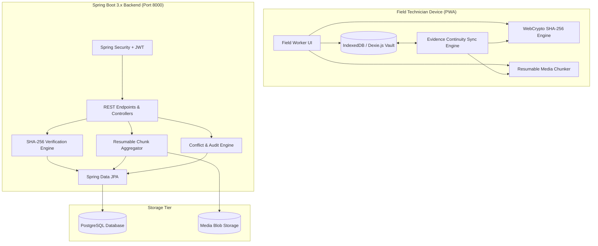

# 🚀 SyncField — Offline-First Field Operations Platform

**SyncField** is an enterprise-grade offline-first field operations platform powered by the **Evidence Continuity Engine**, purpose-built for technicians operating in remote, intermittent, or completely disconnected field environments.

---

## 🏗️ Architectural Overview



---

## ⚡ Evidence Continuity State Machine

```
CAPTURED 
   ↓
STORED_OFFLINE 
   ↓
QUEUED 
   ↓
UPLOADING 
   ↓
PAUSED / RETRYING  <-- (Network loss or simulated interruption at checkpoint)
   ↓
RESUMING           <-- (Continues from last verified chunk byte boundary)
   ↓
UPLOADED 
   ↓
VERIFYING          <-- (Client SHA-256 == Server SHA-256)
   ↓
VERIFIED 
   ↓
SYNCED
```

---

## 👥 Demo Credentials & Roles

| Role | Name | Email | Password |
|---|---|---|---|
| **Field Worker** | Worker-01 (Alex Rivera) | `worker1@syncfield.io` | `password123` |
| **Supervisor** | Supervisor (David Vance) | `supervisor@syncfield.io` | `password123` |
| **Admin** | Admin (Rachel Adams) | `admin@syncfield.io` | `password123` |

---

## ⏱️ 3-Minute Hackathon Presentation Scenario

1. **Worker Login**: Login as `Worker-01 (Alex Rivera)`.
2. **Open Job**: Click on **Solar Panel Inspection** (`JOB-SOLAR-047`, Asset `Panel #47`).
3. **Simulate Offline**: Click `DEMO: SIMULATE NETWORK LOSS` on the top demo bar.
   - UI instantly displays: `🔴 OFFLINE MODE ACTIVE — All Evidence Safely Stored in Local Dexie Vault`.
4. **Capture Evidence Offline**:
   - Fill in Thermal Reading (`68.4°C`) and Diagnostic Notes.
   - Take Photo snapshot, record Short Video, and capture Voice Memo.
   - Check GPS hardware telemetry lock.
5. **Seal Evidence Package**: Click `Save Evidence Package Offline`.
   - UI shows: `📦 EVIDENCE PACKAGE CREATED` & `STORED OFFLINE`.
6. **Restore & Sync**: Click `DEMO: RESTORE NETWORK & RESUME`.
   - The Evidence Continuity Engine triggers queue upload.
7. **Simulate Upload Interruption**: Click `DEMO: INTERRUPT UPLOAD`.
   - UI shows: `⏸️ PAUSED AT CHECKPOINT (e.g., Chunk 2/4 - 8.2 MB saved)`.
8. **Resume Transfer**: Click `DEMO: RESTORE NETWORK & RESUME`.
   - UI displays: `🔄 RESUMING FROM CHECKPOINT` ➔ `🛡️ INTEGRITY VERIFIED (SHA-256 match)`.
9. **Supervisor Audit**: Switch to **Supervisor** role.
   - Inspect the **Supervisor Evidence Vault** and **Audit Timeline**.
10. **Conflict Resolution**: Click `DEMO: INJECT CONFLICT` ➔ Open **Conflict Management** to perform a 3-way version reconciliation.

---

## 🛠️ Quickstart Local Setup

### 1. Prerequisites
- Node.js 18+ and npm
- Java 17+ and Maven (for backend)
- (Optional) Docker for local PostgreSQL

### 2. Run Backend
```bash
cd backend
mvn spring-boot:run
```
*The backend starts at `http://localhost:8000` with pre-seeded demo users, jobs, and an in-memory H2 database (or PostgreSQL if configured).*

### 3. Run Frontend
```bash
cd frontend
npm install
npm run dev
```
*The PWA frontend starts at `http://localhost:3000`.*

---

## 📡 REST API Summary

- `GET /api/health` — Health check endpoint
- `POST /api/auth/login` — JWT Authentication
- `GET /api/jobs` — Retrieve assigned field jobs
- `POST /api/operations` — Idempotent sync endpoint with SHA-256 manifest
- `POST /api/evidence/init` — Initialize chunked upload session
- `POST /api/evidence/chunk` — Resumable binary chunk upload
- `POST /api/evidence/verify` — Cryptographic SHA-256 verification
- `GET /api/conflicts` — List detected version conflicts
- `POST /api/conflicts/{id}/resolve` — 3-way conflict resolution
- `GET /api/audit/recent` — Immutable audit log timeline
- `GET /api/dashboard` — Supervisor statistics and metrics
